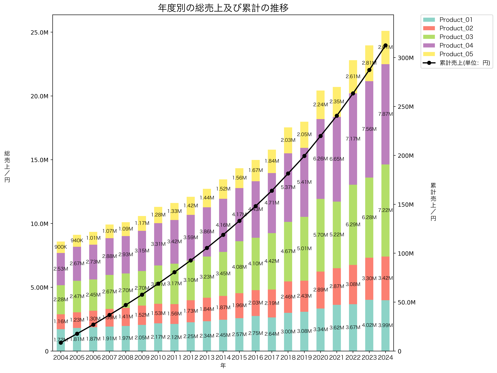
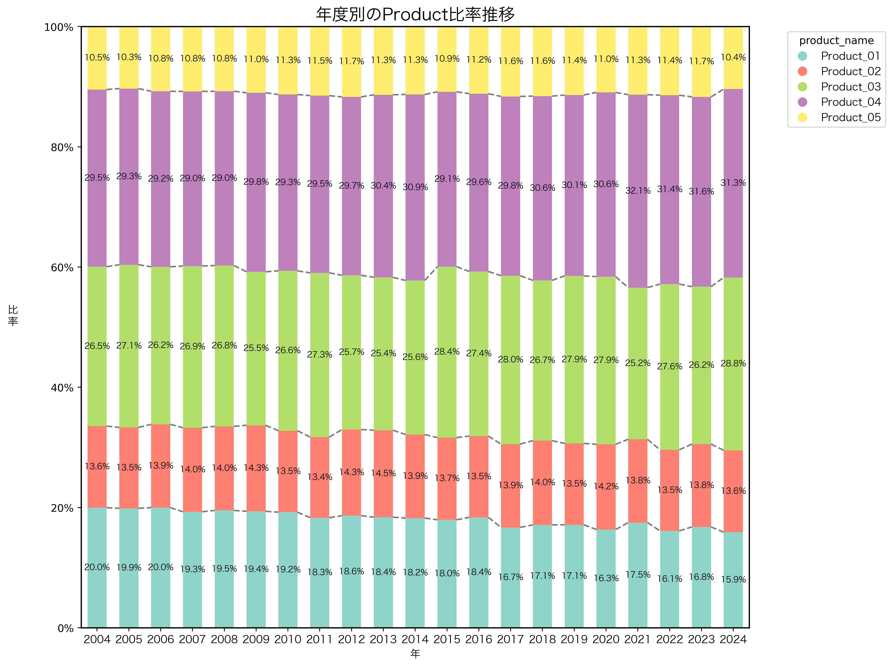
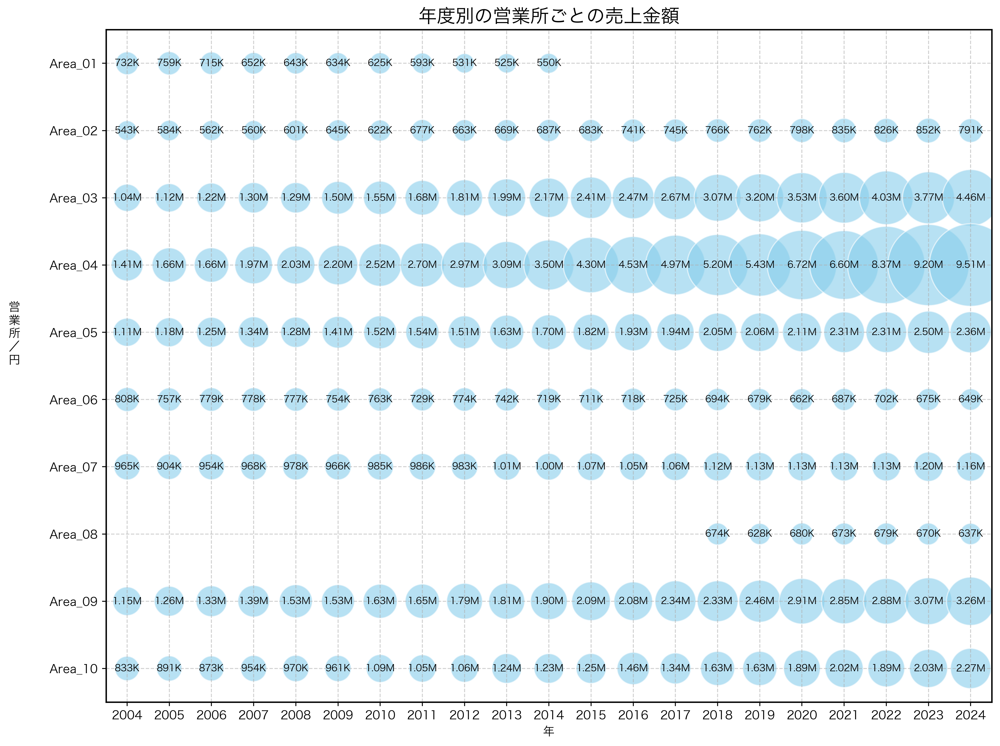
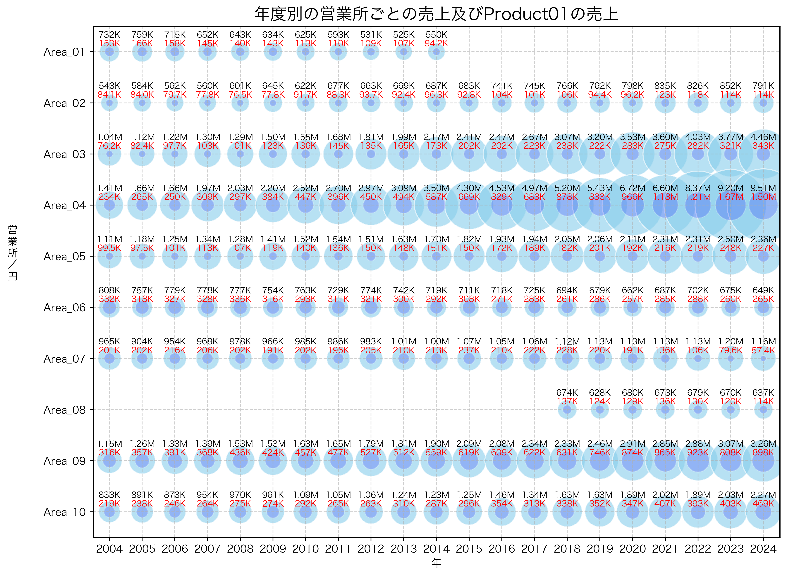
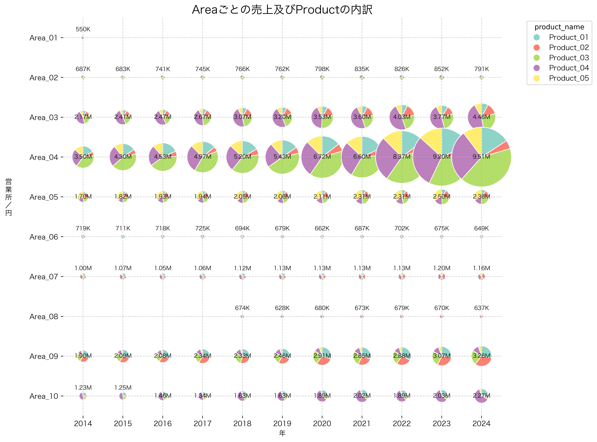
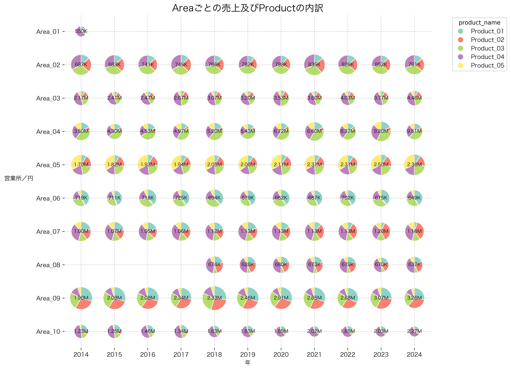

# 📊 Data Visualization Samples by Hiropon

Python（pandas, plotly, matplotlib）を用いたデータ可視化サンプル集です。  
業務で扱う出願データや売上推移などを、見やすく・再現性のある形で可視化しています。

---

## 年度別の総売上及び累計の推移(積み上げ棒グラフ＋折れ線の二軸構成)

- 単位を変換（K / M / B）することは対応可能です  
- 凡例の位置を調整することができます  

---

## 年度別のProductの構成比(積み上げ棒グラフ)

- 単位を変換（K / M / B）することは対応可能です  
- 凡例の位置を調整することができます  

---

## 年度別の営業所ごとの売上(バブルチャート)

- バブルの大きさは、現在表示されている売上の中で最も大きいものが最大としています(ここでは2024年Area_04の売上が最大です)
- 単位を変換（K / M / B）することは対応可能です  
---

## 年度別の営業所ごとの売上及びProduct_01の売上(2層のバブルチャート)

- 黒字は売上を表し、赤字はProduct_01の売上を表しています
- 重なりが大きいほど売上中のProduct_01の割合が大きい -> Product_01が主力と推測できる
- 重なりが小さいほど売上中のProduct_01の割合が小さい -> 他のProductが主力と推測できる
- 単位を変換（K / M / B）することは対応可能です  
- Product_01以外のProductに変更可能
- 縦軸を営業所(Area)にしてバブルの対象をProductに変更可能

---

## 年度別の営業所ごとの売上及びProductの内訳(バブルと円との組み合わせ)_その1

- 円の大きさ：表示されている全営業所の中で最も売上が大きい箇所を基準にしている(ここでは2024年Area_04の売上が基準になる) -> 主力営業所が判断しやすいが、各営業所ごとのProductの売上構成比の推移が見づらい
- Area_01は2015年以降撤退したことを想定している
- Area_08は2018年に出店したことを想定している
- 単位変換（K / M / B）は対応可能です  
- 縦軸をProductにして円の対象をAreaに変更することは可能です
- 横軸は10項目程度が視覚的に限度と思われます

---

## 年度別の営業所ごとの売上及びProductの内訳(バブルと円との組み合わせ)_その2

- 円の大きさ：営業所ごとに異なっており、各営業所の中で最も売上が大きい箇所を基準にしている(例えば、Area_04ならArea_04の中で最も売上が大きい箇所が最大であるとして他の円の大きさを設定している) -> 各営業所ごとのProductの売上構成比の推移が見やすいが、主力営業所が判断しづらい
- Area_07にて売上構成比が変化していることがわかる
- Area_01は2015年以降撤退したことを想定している
- Area_08は2018年に出店したことを想定している
- 縦軸のラベルを縦書き風にすることは可能です
- 単位を変換（K / M / B）することは対応可能です  
- 縦軸をProductにして円の対象をAreaに変更することは可能です
- 横軸は10項目程度が視覚的に限度と思われます

---

## 使用技術
- Python 3.13.3  
- pandas / numpy / matplotlib / plotly  
- openpyxl / sqlite3  
