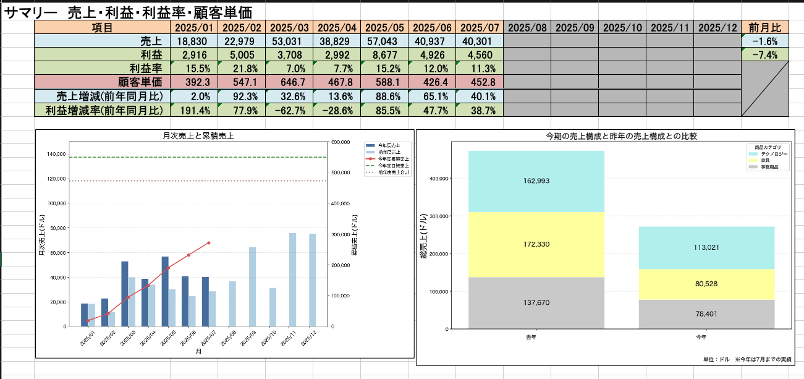
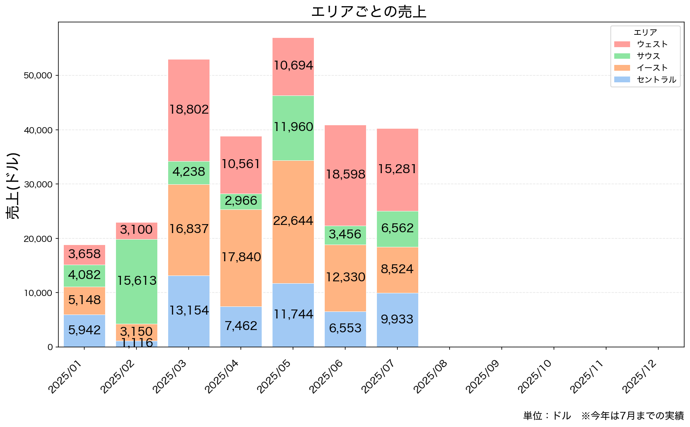
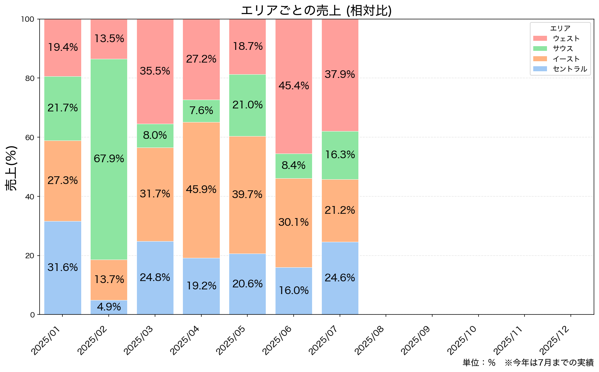
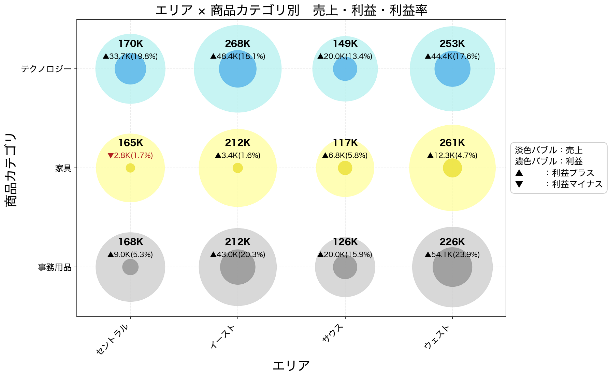
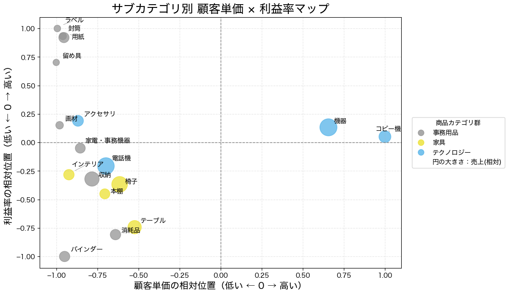
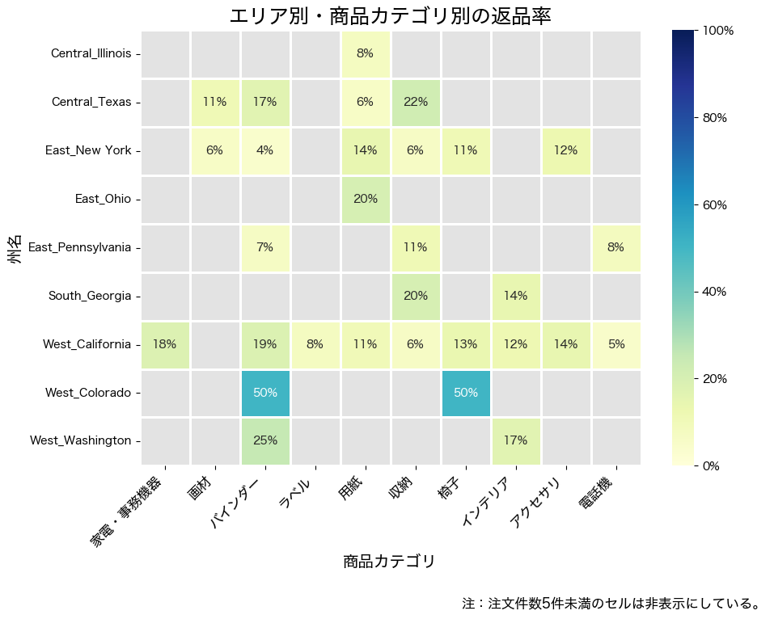

# 今期分析ポートフォリオ

## このレポートでできること
今期の売上データから、売上・利益・返品・注文傾向を整理し、改善ポイントを発見するための分析資料を作成します。

## 概要
本ポートフォリオは、今期の売上データをもとに、売上・利益・返品・顧客行動の傾向を可視化した分析レポートです。

## 目的
今期の販売状況を把握し、改善すべき商品カテゴリ・地域・顧客層を発見することを目的としています。

## 使用データ
- データ出典：Tableau 公式サンプルデータセット「Sample - Superstore」
- 対象データのファイル形式：excel(.xls)
- 対象データのシート："Order", "People", "Returns" の3種
- 対象期間：今期
- 主な集計軸：商品カテゴリ、サブカテゴリ、エリア、顧客区分、曜日

## notebooks

| ファイル名 | 内容 |
|---|---|
| 01_check_rawdata.ipynb | 分析対象データのファイル構造・カラム概要の確認 |

## 作成したチャート
### 1. 売上・利益・利益率・顧客単価のサマリー
今期の売上・利益・利益率・顧客単価を概観するためのチャートです。

- 表の部分に関して、数値はPython(pandas)による処理で集計し、背景色などのレイアウトはエクセルで行なっています。
- 期初を1月に設定していますが、例えば、4月といった月を期初として集計することも可能です。

### 2. エリアごとの売上の推移
今期の売上をエリア毎に分解して表示するためのチャートです。

- 売上を実際の値で示すことができるほか、相対比として示すことができます。

### 3. エリア × 商品カテゴリ別　売上・利益・利益率
今期の売上・利益・利益率をエリア × 商品カテゴリ別に表示するためのチャートです。

- バブルの大きさは、売上に基づいて設定しています。そのため、バブルが大きいほど売上が大きいといえます。

### 4. サブカテゴリ別 顧客単価 × 利益率
今期の顧客単価と利益率との関係を4象限で表示するためのチャートです。

- 商品カテゴリ別に色分けをしていますので、どの分野が強いか、どの分野を強化するべきかを確認することができます。

### 5. エリア別 × 商品カテゴリ別 返品率
今期の返品率をエリア、及び商品カテゴリ毎に表示するためのチャートです。

## 分析で確認できること
- 今期、売上・利益に貢献している商品カテゴリを確認することができます。
- 利益率が低く、改善余地のある商品群を確認することができます。
- 返品率が高い地域・商品カテゴリの組み合わせを確認することができます。

## 使用技術
- Python
- pandas
- matplotlib
- seaborn

## 補足
本ポートフォリオは、サンプルデータを用いて作成しています。  
実データに適用する場合は、データ構造・列名・集計条件に応じて調整します。