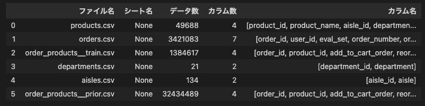
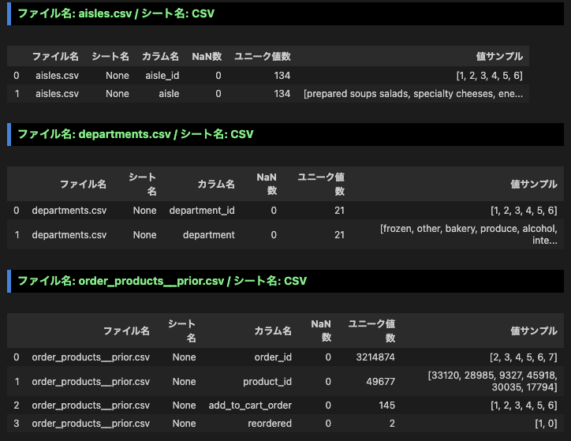

# 📊 Data Visualization Samples by Hiropon

Python（pandas, plotly, matplotlib）を用いたデータ可視化サンプル集です。
Kaggle から提供されているデータをサンプルとして、前処理・整形・可視化を行います。
データ：Instacart Market Basket Analysis

---
## raw data に関する情報を確認する
取得したデータ(raw data)をこのプロジェクト内の「Lv02_raw_data」に格納しました。
raw dataはすべてcsvファイルであることを確認し、それぞれのデータ数、カラム数、及びカラム名を確認しました。
この操作により、処理する raw data の規模感を掴むことができます。

---
## 各 raw data の各カラムに関する情報を確認する
各 raw data の各カラムに関し、NaNの数、ユニーク値(NaN除く)の数、及び値のサンプル(最大6個)を確認しました。

例えば、 aisles.csv には2種類のカラム( aisle_id / aisle )があることがわかります。一方に id が付されているので、識別番号とその識別番号に対応する値とが入力されていることが予想されます。なお、これらのユニーク値の数が互いに一致しているので、 id の重複や漏れがないと思われます。
departments.csv も同様のことが言えると思います。
order_products__prior.csv は今のところ何に使うかはわかりませんが、 reordered 列のユニーク値が2つであり、その値が1、又は0であることを鑑みると、ロジスティック回帰や決定木といった分析ができそうであると考えます。
このように、各 raw data の各カラムに関する情報を確認することにより、データを開かなくても、どのようなカラムがあるか確認することができます。また、ファイル間の関係を予想することができます。
今回は連続値が入力されたカラムはなさそうでした。もし、連続値が入力されていた場合、その平均や箱ひげ図を確認し、値のばらつきを確認しておくのが良いと思います。
